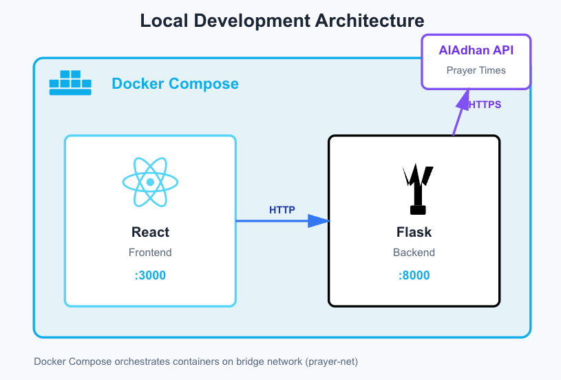
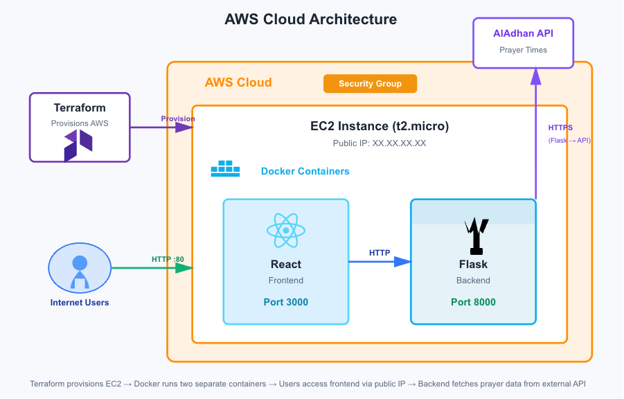

<h1 align="center">🕌 Prayer Times App – Full-Stack DevOps Project</h1>

<p align="center">
  
  
  
  
  
  
  
  
  
  
  
</p>

> A containerized full-stack web app that delivers real-time Islamic prayer times — built to showcase cloud deployment and DevOps workflows.

---

## ⚙️ Core Features

- Retrieve accurate daily prayer times via the AlAdhan API  
- Flask backend serving RESTful endpoints  
- React frontend for displaying prayer times dynamically  
- Dockerized backend and frontend for consistent deployment
- Infrastructure as Code (IaC) with Terraform to deploy on AWS  
- Configurable security group, key pair, and Docker image pull via Terraform  
- Custom bridge network connecting frontend and backend containers

---

## Architecture Overview

### Local (Docker Compose)
Docker Compose orchestrates the **React frontend** and **Flask backend** on a shared bridge network (`prayer-net`).  
The backend communicates with the external **AlAdhan API** to retrieve daily prayer times.



**Flow:**
1. Docker Compose runs two containers: React (frontend) and Flask (backend)
2. Both containers share a bridge network (`prayer-net`)
3. The backend fetches data from the AlAdhan API
4. Frontend runs on port 3000, backend on port 8000

---

### AWS Deployment (Terraform + EC2)
Terraform provisions an **EC2 instance** that runs both Docker containers (frontend and backend).  
Users access the app via the EC2 public IP, while the backend securely fetches data from the **AlAdhan API**.



**Flow:**
1. Terraform creates an AWS EC2 instance and security group
2. EC2 installs Docker and runs the same frontend & backend containers
3. Security Group allows inbound HTTP (port 80) and all outbound traffic
4. The app is publicly accessible via the EC2 public IP

---

## 📁 Project Structure

```text
prayer-times-app/
├── assets/
│   ├── local-architecture.png
│   └── cloud-architecture.png
│
├── backend/
│   ├── main.py
│   └── requirements.txt
│
├── frontend/
│   ├── package.json
│   ├── package-lock.json
│   ├── public/
│   │   ├── index.html
│   │   └── favicon.ico
│   └── src/
│       ├── App.js
│       ├── App.css
│       ├── index.js
│       └── index.css
│
├── terraform/
│   ├── main.tf
│   ├── outputs.tf
│   └── variables.tf
│
├── backend.Dockerfile
├── frontend.Dockerfile
├── docker-compose.yml
├── .gitignore
└── README.md
```

## 🧩 Local Setup Guide

### 1. Clone the repository

```bash
git clone <REPO_URL>
cd prayer-times-app
```

### 2. Backend Setup (Flask)

```bash
cd backend
python -m venv .venv
source .venv/bin/activate # for macOS/Linux     or      .venv\Scripts\activate for Windows
pip install -r requirements.txt
python main.py
```
Then open your browser at: http://localhost:8000/prayer-times/London/UK
Note: You can replace London/UK with any valid city and country, e.g. Toronto/Canada

### 3. Frontend Setup (React)

```bash
cd frontend
npm install
npm start
```
Runs at: http://localhost:3000  
React frontend fetches prayer times from the Flask backend API.

### 4. Run Locally With Docker

```bash
docker-compose up --build
```
Open frontend at http://localhost:3000
Open backend at http://localhost:8000/prayer-times/London/UK

## ☁️ Deploying to AWS using Terraform

### Requirements
- AWS account & CLI configured
- SSH key pair for EC2 access
- Docker Hub account for hosting the image 

### 1. Configure AWS CLI

```bash
aws configure
```
Enter your Access Key, Secret Key, default region (eu-west-1 recommended) & output format (json)

### 2. Build & Push Docker Image to Docker Hub

```bash
docker build -t <YOUR_DOCKERHUB_USERNAME>/prayer-times-app:latest .
docker push <YOUR_DOCKERHUB_USERNAME>/prayer-times-app:latest
```

### 3. Deploy infrastructure with Terraform

```bash
cd terraform
terraform init
terraform apply
```
Enter your AWS key pair name when prompted  
Terraform will:
- Create an EC2 instance
- Create a security group
- Install Docker
- Pull and run your image
After completion, Terraform will output the public IP:
- http://<EC2_PUBLIC_IP>/prayer-times/London/UK

### 4. Access the App

```bash
http://<app_public_ip>/prayer-times/London/UK
```

## Notes for Reviewers
- The project demonstrates DevOps skills: coding, Docker containerization, Infrastructure as Code, cloud deployment
- Uses Docker networking to connect frontend & backend
- HTTPS is recommended for production, but HTTP is used here for simplicity
- Outbound traffic is open in the security group (protocol=-1) to allow Docker image pulls and updates
- Terraform setup can easily scale to ECS or EKS

## Future Improvements
- Add automatic geolocation for user-based prayer times
- Enable HTTPS with Nginx and Let’s Encrypt
- Add CI/CD pipeline for automatic AWS deployment with GitHub Actions
- Mobile-friendly responsive UI
- Deploy on AWS ECS or Fargate

---

<h3 align="center">👤 Author</h3> <p align="center"> <strong>Nasif Islam</strong><br> <a href="https://github.com/Nasif-Islam">GitHub</a> • <a href="https://www.linkedin.com/in/nasiful-i-106287336/">LinkedIn</a> </p> <p align="center"> 🧩 Built to demonstrate full-stack development, containerization, and cloud deployment as part of a DevOps learning journey. </p> ```